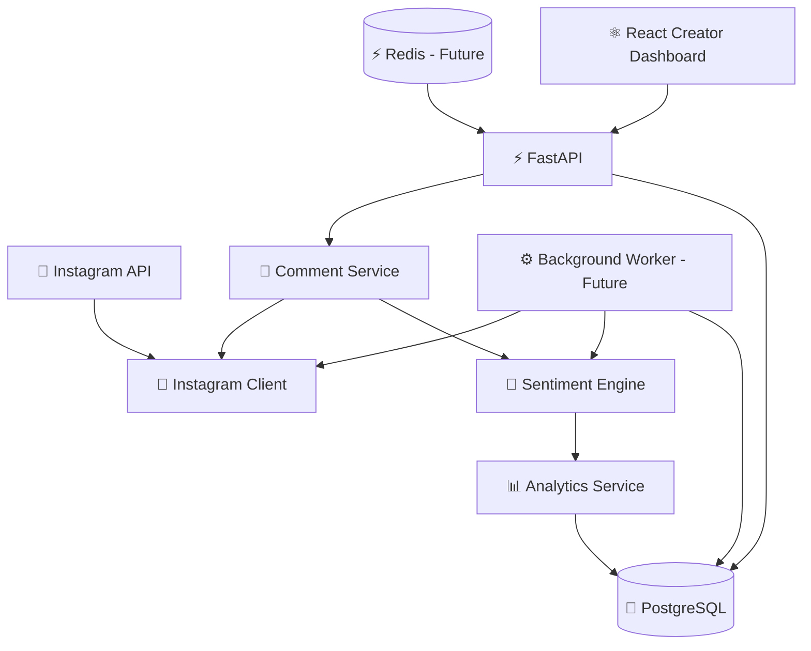

# 🌈 Veya

<p align="center">
  <strong>Understand your audience without absorbing the negativity.</strong>
</p>

<p align="center">
  
  
  
  
  
  
  
  
</p>

---

## 💜 What is Veya?

**Veya** is a creator-focused social media sentiment and wellbeing platform.

It helps creators understand how their audience reacts to their content without forcing them to read every negative, toxic, or abusive comment themselves.

Instead of showing a raw stream of thousands of comments, Veya turns them into meaningful insights:

- ❤️ Positive audience reactions
- 😐 Neutral feedback
- 💡 Constructive criticism
- ⚠️ Negative sentiment
- 🛡️ Toxic or abusive comments
- 🤖 Spam
- 📈 Sentiment trends over time
- ✨ Common themes people love
- 🧠 Actionable content insights

The goal is not to create a fake 100% positive environment.

The goal is to give creators **perspective, control, and useful feedback without unnecessary emotional overload**.

---

## 🎯 Product Vision

Social media often makes a small number of negative comments feel larger than the thousands of positive interactions around them.

Veya gives creators a healthier way to understand their community.

```text
Instagram
    ↓
Posts & Reels
    ↓
Comments
    ↓
Veya Analysis
    ↓
┌──────────────────────────────┐
│      PROFILE SENTIMENT       │
│                              │
│ ❤️ Positive          72.4%   │
│ 😐 Neutral           18.1%   │
│ 💡 Constructive       6.3%   │
│ ⚠️ Toxic / Negative   3.2%   │
│                              │
│ 1,842 comments analyzed      │
└──────────────────────────────┘
```

---

# ✨ Core Features

## ❤️ Profile Positivity

See the overall sentiment across an Instagram profile.

```text
Positive      ███████████████████  74%
Neutral       █████                17%
Negative      ██                    6%
Toxic         █                     3%
```

---

## 📸 Post-Level Sentiment

Each post or reel gets its own sentiment breakdown.

Creators can quickly understand:

- Which posts generate positive engagement
- Which content creates negative reactions
- Which posts receive the most constructive feedback
- How audience sentiment changes over time

---

## 🛡️ Comment Shield

Creators should not need to personally consume abuse just to understand their audience.

Veya can detect harmful comments and keep them out of the default experience.

```text
🛡️ Comment Shield

49 potentially harmful comments were detected.

You do not need to read them to understand
how your audience is responding.

[ View Comments ]
```

The comments can still contribute to analytics while remaining hidden unless the creator chooses to reveal them.

---

## 💡 Constructive Feedback

Not every negative comment is toxic.

Veya aims to distinguish between:

```text
"The audio is difficult to hear."
→ 💡 Constructive feedback

"This video sucks."
→ ⚠️ Negative

"You're disgusting."
→ 🛡️ Toxic / personal attack

"Buy followers here."
→ 🤖 Spam
```

This separation is important because useful criticism should not be treated the same way as harassment.

---

## ✨ Positive Feed

Creators can open a dedicated feed containing supportive comments.

```text
❤️ Positive Feed

"This made my day!"

"Your travel videos are getting better and better."

"I love this outfit 😍"

"Please make more videos like this!"
```

---

## 🧠 Audience Summary

Instead of reading 2,000 comments manually:

```text
WHAT PEOPLE LOVED ❤️

• Your outfit
• The location
• Your editing style
• Your sense of humor


CONSTRUCTIVE FEEDBACK 💡

• Several viewers mentioned low audio volume.
• People would like longer travel videos.
• Many users asked where the outfit is from.


COMMENT SAFETY 🛡️

43 toxic comments filtered
12 spam comments filtered
```

---

# 🚀 MVP

The first version of Veya will deliberately stay small.

### MVP Scope

- [ ] Connect to Instagram
- [ ] Retrieve Instagram media
- [ ] Retrieve comments
- [ ] Support comment pagination
- [ ] Analyze sentiment
- [ ] Classify comments as positive / neutral / negative
- [ ] Calculate percentages
- [ ] Generate post sentiment results
- [ ] Generate profile sentiment results
- [ ] Expose results through FastAPI
- [ ] Add unit and integration tests

Example response:

```json
{
  "comments_analyzed": 437,
  "sentiment": {
    "positive_percentage": 63.16,
    "neutral_percentage": 16.02,
    "negative_percentage": 20.82
  }
}
```

---

# 🏗️ Architecture



---

# 🧱 Planned Application Layers

```text
API / Routes
    ↓
Application Services
    ↓
Domain / Sentiment Logic
    ↓
Repositories
    ↓
Infrastructure
    ├── Instagram API
    ├── PostgreSQL
    ├── NLP Model
    └── Background Jobs
```

The intention is to keep external infrastructure separate from business logic so the codebase remains easy to test and maintain.

---

# 📁 Planned Project Structure

```text
veya/
│
├── backend/
│   ├── src/
│   │   └── veya/
│   │       ├── main.py
│   │       │
│   │       ├── api/
│   │       │   └── routes/
│   │       │
│   │       ├── application/
│   │       │   ├── comments/
│   │       │   ├── sentiment/
│   │       │   └── analytics/
│   │       │
│   │       ├── domain/
│   │       │   ├── comments/
│   │       │   └── sentiment/
│   │       │
│   │       ├── infrastructure/
│   │       │   ├── instagram/
│   │       │   ├── database/
│   │       │   └── nlp/
│   │       │
│   │       └── repositories/
│   │
│   └── tests/
│       ├── unit/
│       └── integration/
│
├── frontend/\n│   ├── src/\n│   ├── package.json\n│   └── Dockerfile\n│\n├── docker/
│
├── .github/
│   └── workflows/
│
├── docker-compose.yml
├── Dockerfile
├── pyproject.toml
├── .env.example
└── README.md
```

---

# 🛠️ Technology Stack

## 🐍 Backend

### Python 3.12

Python will be the primary backend language.

Why:

- Excellent NLP ecosystem
- Strong FastAPI support
- Mature machine learning libraries
- Easy integration with Hugging Face
- Good ecosystem for data processing and analytics

---

## ⚡ API Framework

### FastAPI

FastAPI will expose the Veya backend.

Planned responsibilities:

- Instagram connection endpoints
- Post sentiment endpoints
- Profile sentiment endpoints
- Authentication endpoints
- Analytics endpoints
- Dashboard APIs

Benefits:

- Async support
- Automatic OpenAPI documentation
- Pydantic validation
- Fast development cycle
- Excellent Python type support

---

## ⚛️ Frontend\n\n### React + TypeScript + Vite\n\nVeya includes a React.js creator dashboard from the foundation phase. The initial UI is a colorful profile-positivity shell, with planned screens for Instagram connection, dashboard analytics, posts, post details, Positive Feed, Comment Shield, AI insights, historical trends, and settings. The frontend is containerized independently and communicates with the FastAPI backend over HTTP.\n\n---\n\n# 🐘 Database

### PostgreSQL

PostgreSQL will be the primary persistent database.

Planned data includes:

- Users
- Connected Instagram accounts
- Instagram media metadata
- Comment metadata
- Sentiment classifications
- Sentiment scores
- Profile analytics
- Historical analytics
- OAuth connection metadata

Potential entities:

```text
users
instagram_accounts
media
comments
comment_sentiments
profile_snapshots
post_analytics
sync_jobs
```

### SQLAlchemy

SQLAlchemy will be used for ORM/database access.

### Alembic

Alembic will manage schema migrations.

```text
Python Models
     ↓
 SQLAlchemy
     ↓
   Alembic
     ↓
 PostgreSQL
```

---

# 🐳 Docker

Veya will be containerized from the beginning.

Docker will provide:

- Reproducible development environments
- Isolated Python dependencies
- Local PostgreSQL
- Easy onboarding
- Production-ready container builds

Initial Docker Compose environment:

```text
┌────────────────────────────┐
│       Docker Compose       │
│                            │
│  ⚡ Veya API               │
│      Python + FastAPI      │
│                            │
│  🐘 PostgreSQL             │
│                            │
└────────────────────────────┘
```

Future:

```text
┌────────────────────────────┐
│       Docker Compose       │
│                            │
│  ⚡ API                    │
│  🐘 PostgreSQL             │
│  ⚙️ Worker                 │
│  ⚡ Redis                  │
│                            │
└────────────────────────────┘
```

---

# 🧠 Sentiment & AI Infrastructure

The first version will use a pretrained NLP model rather than calling an expensive LLM for every comment.

### Hugging Face Transformers

Potential starting model:

```text
cardiffnlp/twitter-roberta-base-sentiment-latest
```

Initial classifications:

- ❤️ Positive
- 😐 Neutral
- ⚠️ Negative

Later classifications:

- 💡 Constructive criticism
- 🛡️ Toxic
- 🚨 Severe abuse
- 🤖 Spam

Future versions may use an LLM for higher-level summaries such as:

- What people loved
- Recurring complaints
- Constructive feedback themes
- Content recommendations
- Weekly audience summaries

---

# 📸 Instagram Infrastructure

Veya will integrate with the official Instagram / Meta APIs rather than relying on password-based scraping.

Planned flow:

```text
Creator
   ↓
Instagram OAuth
   ↓
Meta / Instagram API
   ↓
Media
   ↓
Comments
   ↓
Veya
```

Veya should request only permissions required for the product.

Access tokens and OAuth credentials must never be committed to the repository.

---

# ⚙️ Background Processing

This is not required for the first MVP.

As the platform grows, comment synchronization and sentiment analysis should move to background processing.

Potential infrastructure:

- Celery / Dramatiq / ARQ
- Redis
- Scheduled synchronization jobs

Example:

```text
Instagram
    ↓
Sync Job
    ↓
Queue
    ↓
Worker
    ↓
Sentiment Model
    ↓
PostgreSQL
```

This prevents large comment imports from blocking API requests.

---

# ⚡ Caching

Redis may later be introduced for:

- Cached profile analytics
- Rate limiting
- Background queues
- Temporary synchronization state
- Frequently requested dashboards

Redis is **not required for the initial MVP**.

---

# 🔐 Security

Security principles:

- Secrets live in environment variables
- Instagram access tokens are never committed
- OAuth tokens should be encrypted at rest
- Database credentials should come from environment configuration
- API input should be validated using Pydantic
- Least-privilege Instagram permissions
- Users should be able to disconnect their accounts
- Stored social data should be deletable

Example local configuration:

```env
DATABASE_URL=postgresql+psycopg://veya:veya@db:5432/veya
INSTAGRAM_CLIENT_ID=
INSTAGRAM_CLIENT_SECRET=
INSTAGRAM_REDIRECT_URI=
```

---

# 🧪 Testing

Planned testing stack:

### pytest

```text
tests/
├── unit/
│   ├── sentiment/
│   ├── comments/
│   └── analytics/
│
└── integration/
    ├── instagram/
    ├── api/
    └── database/
```

Tests should cover:

- Sentiment classification
- Percentage calculations
- Empty comment sets
- Pagination
- Instagram API errors
- Invalid API responses
- Database persistence
- API endpoints
- Toxicity classification

---

# 🧹 Code Quality

### Ruff

Ruff will handle:

- Linting
- Import sorting
- Formatting

### Type checking

The project should progressively use strict Python typing.

Potential tooling:

- mypy or Pyright

---

# 🔄 CI/CD

GitHub Actions will run automated checks for pull requests.

Planned pipeline:

```text
Pull Request
     ↓
Ruff
     ↓
Unit Tests
     ↓
Integration Tests
     ↓
Build Docker Image
     ↓
✅ Ready to Merge
```

---

# 🌍 Multilingual Sentiment

Instagram audiences frequently communicate using multiple languages and mixed-language comments.

Future Veya versions should support:

- English
- Urdu
- Roman Urdu
- Hindi
- Hinglish
- Arabic
- Additional languages based on creator audiences

Example:

```text
"Love this outfit 😍"
→ Positive

"yeh bohat acha lag raha hai"
→ Positive

"audio thora clear hona chahiye"
→ Constructive feedback
```

---

# 📈 Future Analytics

## Content Performance

```text
Travel        █████████████████  86%
Fashion       ████████████████   81%
Lifestyle     ██████████████     74%
Sponsored     ███████████        58%
```

## Sentiment Over Time

```text
Week 1    61%  ████████████
Week 2    66%  █████████████
Week 3    73%  ███████████████
Week 4    79%  ████████████████

                 ↑ +18%
```

---

# 🗺️ Roadmap

## 🟣 Phase 1 — Foundation

- [x] Initialize Python 3.12 project
- [x] Add FastAPI
- [x] Add application configuration
- [ ] Configure Ruff
- [ ] Configure pytest
- [x] Add Dockerfile
- [x] Add Docker Compose
- [x] Add PostgreSQL
- [x] Add SQLAlchemy
- [x] Add Alembic dependencies

## 🩷 Phase 2 — Instagram

- [ ] Create Meta / Instagram application
- [ ] Configure Instagram OAuth
- [ ] Implement Instagram API client
- [ ] Retrieve media
- [ ] Retrieve comments
- [ ] Handle pagination
- [ ] Handle rate limits
- [ ] Handle API errors

## 🟢 Phase 3 — Sentiment MVP

- [ ] Integrate sentiment model
- [ ] Analyze comments
- [ ] Positive classification
- [ ] Neutral classification
- [ ] Negative classification
- [ ] Calculate sentiment percentages
- [ ] Post sentiment endpoint
- [ ] Profile sentiment endpoint

## 🟠 Phase 4 — Comment Safety

- [ ] Toxicity detection
- [ ] Constructive criticism detection
- [ ] Severe abuse detection
- [ ] Spam detection
- [ ] Comment Shield
- [ ] Positive Feed

## 🔵 Phase 5 — Intelligence

- [ ] Positive theme extraction
- [ ] Constructive feedback summaries
- [ ] Common complaint detection
- [ ] Post summaries
- [ ] Profile summaries
- [ ] Content category comparisons
- [ ] Multilingual analysis

## 🟡 Phase 6 — Product

- [ ] User authentication
- [ ] PostgreSQL persistence
- [ ] Background synchronization
- [ ] Redis
- [ ] Background workers
- [ ] Creator dashboard
- [ ] Historical analytics
- [ ] Notifications
- [ ] Production deployment

---

# 🧭 Infrastructure Evolution

### MVP

```text
Instagram API
      ↓
FastAPI
      ↓
Sentiment Model
      ↓
PostgreSQL
```

### Growth

```text
                ┌──────────────┐
                │  Instagram   │
                └──────┬───────┘
                       │
                       ▼
                ┌──────────────┐
                │   FastAPI    │
                └──────┬───────┘
                       │
         ┌─────────────┼─────────────┐
         ▼             ▼             ▼
   PostgreSQL        Redis         Queue
                                       │
                                       ▼
                                    Worker
                                       │
                                       ▼
                               Sentiment / AI
```

---

# 🌱 Philosophy

Veya is not designed to tell creators:

> "Everything is positive."

Instead, it aims to say:

> "Here is what your audience actually feels, here is the feedback worth paying attention to, and here is the negativity you do not need to personally absorb."

Social media feedback should be **information**, not emotional overload.

---

<p align="center">
  <strong>💜 Veya</strong>
  <br />
  Understand your audience without absorbing the negativity.
</p>
